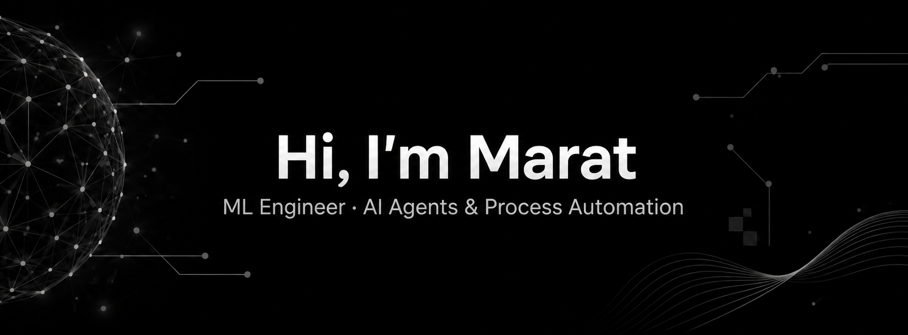

  

  <a href="https://www.linkedin.com/in/maratg2/">LinkedIn</a>
  ·
  <a href="mailto:maratg2develop@gmail.com">Email</a>
  ·
  <a href="https://t.me/maratg2">Telegram</a>

---

## 🧠 What I build

I build **production AI systems that automate business processes**, combining machine learning, software engineering and real business context.

My work spans **AI agents, architecture, orchestration, integrations, evaluation and end-to-end delivery** — from designing a system and connecting its tools to shipping the services that run it in production.

Previously, I developed a **generative AI services platform at [krem.digital](https://krem.digital/)** and later progressed to **CTO**.

## ⚙️ Engineering focus

* 🤖 **AI agents & workflow automation** — agent systems, tool use, orchestration and multi-step business processes
* 🧪 **Reliable AI applications** — evaluation, quality control and production-oriented AI engineering
* ⚡ **Backend & data** — Python services, APIs, SQL, PostgreSQL and data processing
* 🎛️ **Generative media** — image, video and audio pipelines, ComfyUI and LoRA workflows

## 🧰 Stack

`Python` · `FastAPI` · `SQL` · `PostgreSQL` · `Docker` · `React` · `Next.js` · `ComfyUI` · `LoRA`

My earlier C# and Unity work is part of my broader software engineering foundation.

## 📊 GitHub

  

  

